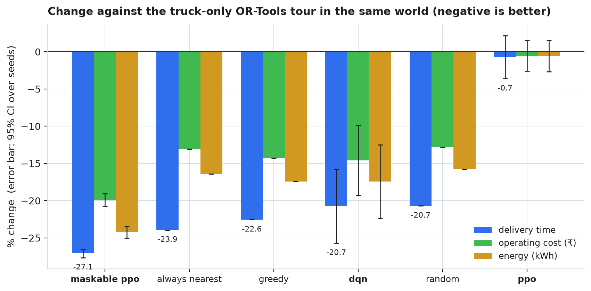
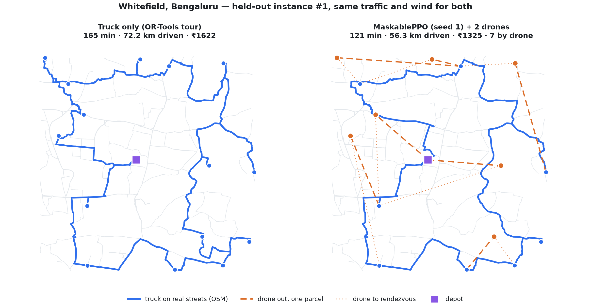
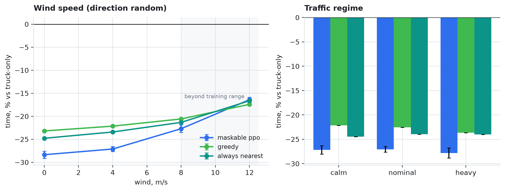
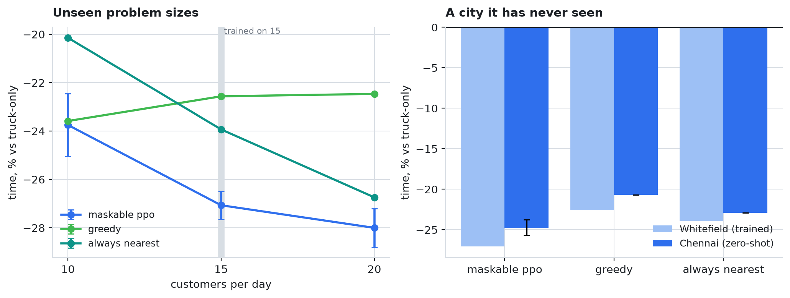
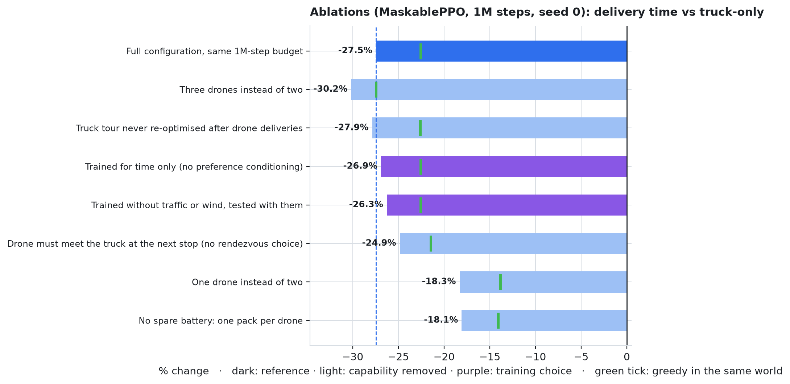
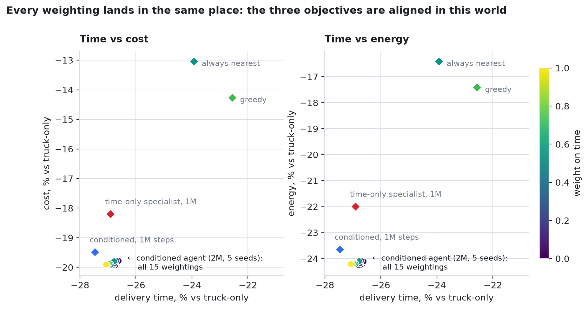
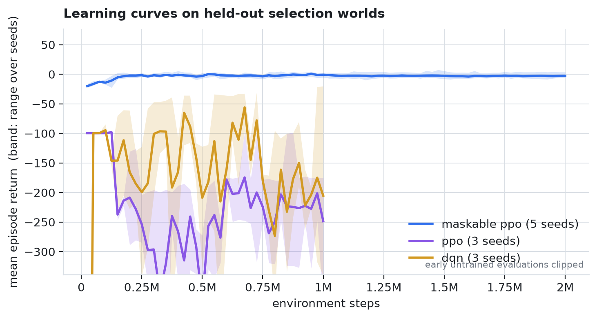
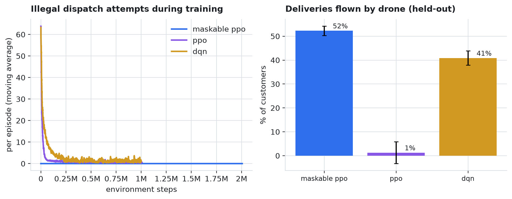

# Truck–Drone Collaborative Delivery — Deep Reinforcement Learning

A working simulator for last-mile delivery in which a truck acts as a **mobile
launch platform** for drones, and a reinforcement-learning dispatcher decides,
at every stop, whether to drive on or to launch a drone — **which** customer it
should fly to, and **where** down the route it should meet the truck again.
Any customer a drone serves is struck off the truck's route, so sorties remove
heavy-vehicle kilometres *and* the minutes the driver would have spent at that
door. That is the mechanism the whole idea rests on.

**Live demo:** https://truck-drone-rl.vercel.app

```bash
pip install -r requirements.txt
python run_demo.py            # evaluate + figures if missing, then open the dashboard
```

**Headline (20 held-out delivery days × 5 traffic/wind worlds, 5 training seeds):**
MaskablePPO finishes a 15-customer day **27.1% ± 0.6 faster** than the OR-Tools
truck-only tour driven through the same traffic and wind — 134 min against
184 — at **19.9% lower cost** and **24.2% less energy**, completing every route
with zero illegal dispatches. It beats every hand-written heuristic on all
three objectives, and keeps its lead in a city it never trained on.

---

## What changed since Review 1

Review 1 committed to a set of capabilities, and the first project review
ended with a list of next steps. Every item is now implemented, tested and
measured:

| promised | where | now |
|---|---|---|
| Real city layouts via OSMnx | DA1 | Truck distances are **directed shortest paths through the full OpenStreetMap drive network** — 9,818 intersections and 22,287 street segments in Whitefield, one-way streets included. The v1 synthetic edges and the assumed 1.35 tortuosity factor are gone; tortuosity is now *measured* (mean 1.52). |
| Adapt to wind and unexpected traffic | DA1 | **Stochastic world**: time-of-day congestion with morning and evening rush peaks, a day-level factor, unpredictable per-leg noise, and a per-episode wind vector that stretches or shrinks every sortie. |
| Multi-objective: time, energy, cost, without hand-tuned weights | DA1 | A rupee **cost model** and an energy model, and a **preference-conditioned** reward: one policy is trained across the whole time/energy/cost simplex and the operator picks the balance at run time. |
| Rendezvous selection in the action space | DA1 | Action = (customer, **rendezvous**). A sortie can span several truck legs. |
| Drone location in the state | DA1 | Per drone: airborne flag, time until it lands, and its rendezvous point relative to the truck. |
| PPO over millions of timesteps | DA1 | **23 M environment steps** in total; MaskablePPO 2 M × 5 seeds, PPO and DQN 1 M × 3 seeds, 8 parallel environments each. |
| Folium maps | DA1 | Interactive maps of solved routes on the real streets (`truckdrone/realmap.py`), linked from the dashboard. |
| Re-optimise the truck tour after drone assignment | review 1 | Asymmetric 2-opt + relocate on the remaining stops after every drone delivery. |
| Model per-stop service time | review 1 | 120 s at every door the truck serves itself. |
| Multiple seeds with confidence intervals | review 1 | Every learned number is a mean over seeds with a 95% t-interval. |
| Stochastic travel times and wind | review 1 | See above. |
| Transfer to a second city | review 1 | Zero-shot evaluation on **T. Nagar, Chennai** (16,139 intersections, 83% of site pairs asymmetric). |

## The problem the agent solves

A truck carries two drones, each with **two hot-swappable battery packs**. It
must serve 15 customers and return to the depot. At each stop the dispatcher
takes one action:

| action | meaning |
|---|---|
| `0` | drive on to the next required stop |
| `1 + k·R + r` | launch a drone to the *k*-th nearest unserved customer (K = 5) and recover it at the truck's (*r*+1)-th required stop (R = 2) |

So there are 11 actions. A drone carries **one parcel per sortie**: truck →
customer → rendezvous with the truck further down the route. A drone still in
the air is not offered, so no drone is ever assigned two customers at once.

**Action masking.** The environment reports which launches are physically
legal — a drone is free, the customer and rendezvous exist, and the sortie,
*with the wind it will actually meet*, leaves the 10% battery reserve intact.
MaskablePPO drives illegal logits to −∞, so the agent never wastes an
interaction on an impossible launch. The mask and the dispatch read the same
launch plan, so they cannot disagree; a test asserts it over thousands of
states.

**Observation** (53 numbers): truck position (an MDS embedding of the road
distance matrix, so Euclidean distance ≈ driving distance); per drone its
fullest pack, mean charge, airborne flag, time until it lands and where its
rendezvous lies relative to the truck; route progress and elapsed time; the
wind vector, the current congestion level and the time of day; the operator's
preference weights; and for each of the five nearest customers its air
distance and bearing plus, for each rendezvous option, **the road detour the
truck saves by skipping that customer** and how the sortie's timing compares
with the truck's arrival at the rendezvous.

**Reward.** Each leg produces increments of elapsed time, energy (diesel incl.
idling + drone electricity) and cost (driver ₹300/h, diesel ₹92/L, electricity
₹9/kWh, ₹12/sortie battery wear). The reward is −w·Δ, each objective
normalised by the truck-only route in the same world, plus a completion bonus
and a penalty per abandoned customer. With w = (1, 0, 0) it reduces exactly to
the time-only reward of v1 (−2 per minute), which a test pins.

## The world

* **Streets.** 50 delivery sites snapped to intersections of the real
  OpenStreetMap drive graph; every truck distance is a directed shortest path
  through ~10k intersections. 46% of site pairs in Whitefield (83% in Chennai)
  are asymmetric because of one-way streets. The dashboard and maps draw the
  actual street polylines.
* **Traffic.** Free-flow 30 km/h scaled by a time-of-day profile with peaks at
  09:30 and 18:30 (×1.7), a log-normal day factor (σ 0.1) and per-leg noise
  (σ 0.15) drawn with common random numbers, so every policy meets the same
  traffic on the same street at the same time. The agent observes the
  congestion level but not the noise — that is the "unexpected" part.
* **Wind.** Each episode draws a wind of 0–8 m/s from a random direction.
  Drones fly at constant airspeed, so a headwind stretches both flight time and
  energy; feasibility is checked against the wind actually met.
* **Service time.** 120 s at every door the truck serves itself — parking,
  walk, handover. A drone delivery removes it entirely.
* **Re-planning.** Once drones have taken customers off the route, the order
  of the remaining stops is re-optimised (asymmetric 2-opt and relocate),
  never moving a stop a drone is due to meet.
* **Batteries.** A pack charges only while it is on the truck: the spare
  charges the whole time the drone is away, the pack that flew only once it
  lands. Swapping costs 60 s.

## Training

```bash
python -m truckdrone.campaign          # the whole campaign, resumable (~3 h on 14 cores)
```

| agent | steps | seeds | notes |
|---|---|---|---|
| MaskablePPO | 2 M | 5 | invalid actions masked |
| PPO | 1 M | 3 | same network and hyperparameters, no mask |
| DQN | 1 M | 3 | same action space |
| ablations | 1 M | 1 each | eight variants, see below |

Every agent is preference-conditioned. Experience comes from 8 environments
in parallel processes. The best checkpoint is chosen on *selection worlds*
that are disjoint from the evaluation worlds, so model selection never sees the
test set.

## Evaluation protocol

* **Held-out instances.** 40 delivery days share the Whitefield network; the
  agents train on 20 and every reported number comes from the other 20.
* **Several worlds per instance.** Each held-out day is run in 5 fixed worlds
  (traffic, wind, start hour) — 100 episodes per policy.
* **Paired against a strong baseline.** Every run is compared with the
  OR-Tools truck-only tour (guided local search) driven through *the same
  world*, so day difficulty and weather cancel.
* **Completion-gated.** Time, cost and energy are averaged over completed
  routes only; a policy that abandons customers gets no delivery statistic.
  (An earlier version of this project reported a 15% saving that was two runs
  which had abandoned 13 of 15 packages.)
* **Seeds and tests.** Learned results are means over training seeds with a
  95% t-interval; differences are tested with paired t and Wilcoxon
  signed-rank tests over the 100 (instance, world) pairs, reported with the
  win count.

## Results

All numbers are paired % changes against the OR-Tools truck-only tour in the
same world; negative is better. ± is the 95% confidence interval across
training seeds. Full tables: [`results/results_table.md`](results/results_table.md).

| policy | seeds | routes completed | time | cost | energy | CO₂ | flown by drone |
|---|---|---|---|---|---|---|---|
| **MaskablePPO** | 5 | **100%** | **−27.1% ± 0.6** | **−19.9% ± 0.9** | **−24.2% ± 0.8** | **−23.2% ± 0.8** | 52% |
| always nearest | — | 100% | −23.9% | −13.0% | −16.4% | −15.3% | 67% |
| greedy | — | 100% | −22.6% | −14.3% | −17.4% | −16.3% | 54% |
| random | — | 100% | −20.7% | −12.8% | −15.8% | −14.7% | 51% |
| DQN | 3 | 88% | −20.7% ± 4.9 | −14.6% ± 4.7 | −17.4% ± 4.9 | −16.7% ± 4.9 | 41% |
| PPO (no mask) | 3 | 99% | −0.7% ± 2.9 | −0.5% ± 2.1 | −0.6% ± 2.1 | −0.6% ± 2.0 | 1% |

The five MaskablePPO seeds land between −26.5% and −27.6%: the result does not
depend on a lucky run.

**Is the lead real?** Paired over the 100 (day, world) pairs:

| MaskablePPO vs | time | won | cost | won | Wilcoxon p (time) |
|---|---|---|---|---|---|
| always nearest | −6.0 min | 67/100 | −₹112 | 94/100 | 1.1 × 10⁻⁵ |
| greedy | −8.1 min | 76/100 | −₹91 | 88/100 | 1.8 × 10⁻¹⁰ |
| random | −11.4 min | 81/100 | | | 2.1 × 10⁻¹² |
| truck only | −49.4 min | 100/100 | | | 3.9 × 10⁻¹⁸ |

The lead is clearest on cost and energy: it wins 94 of 100 runs on cost against
the strongest heuristic. `always_nearest` flies more (67% of customers) and
pays for it in pack swaps and drone wear; the agent flies fewer, better-chosen
sorties.

**Masking is the difference between learning and not.** Unmasked PPO, with
identical network and hyperparameters, learns that sorties are dangerous and
stops flying (1% by drone, −0.7%). DQN keeps attempting illegal launches
(9.5 per episode) and abandons customers on 12% of routes; its time figure is
computed over the routes it finished. The masked agent never attempts one.

### One agent, every priority — and what that revealed

The agent was trained preference-conditioned: each episode draws a weighting
over (time, energy, cost) and shows it to the agent. Asked for 15 weightings
across the simplex, it lands **in the same place every time** (time −26.6 to
−27.1%, cost −19.8 to −19.9%). That is a finding about the problem, not a
failure of the method: in this world the objectives are *aligned*. A typical
sortie removes ~1.5 km of driving and a 2-minute doorstep stop, saving about
₹46 of diesel and driver time and 1.8 kWh, while costing ₹12.5 and 0.05 kWh of
drone energy. Any sortie worth flying for time is worth flying for money and
energy too, so there is no trade-off for the knob to steer.

Conditioning still paid off. At a matched 1M-step budget, the conditioned
agent beat a specialist trained on time alone on cost (−19.5% vs −18.2%) and
energy (−23.7% vs −22.0%), with no significant difference in time
(p = 0.34) — seeing the cost and energy signals during training taught it
cheaper sorties at no time penalty. (One seed each.)

### Robustness

| setting | MaskablePPO | greedy | always nearest |
|---|---|---|---|
| wind 0 m/s | −28.3% | −23.2% | −24.8% |
| wind 4 m/s | −27.1% | −22.1% | −23.4% |
| wind 8 m/s | −22.7% | −20.6% | −21.3% |
| wind 12 m/s *(beyond training)* | −16.4% | −17.4% | −16.6% |
| calm traffic | −27.2% | −22.1% | −24.5% |
| heavy traffic (rush ×2.5, noise σ 0.3) | −27.8% | −23.7% | −24.0% |

Traffic barely moves the agent's lead — the agent observes congestion and the
baseline suffers the same traffic. Wind is the binding constraint: every policy
loses ground as headwinds shrink the set of feasible sorties, and the agent's
advantage narrows with it. At 12 m/s, outside anything it saw in training, its
edge is gone (−16.4% vs −17.4% for greedy) — but it still completes every
route, because the mask, not the policy, guarantees feasibility.

### Generalisation

| test set | MaskablePPO | greedy | always nearest |
|---|---|---|---|
| 10 customers per day *(unseen size)* | −23.7% | −23.6% | −20.1% |
| 15 customers *(trained)* | −27.1% | −22.6% | −23.9% |
| 20 customers per day *(unseen size)* | −28.0% | −22.5% | −26.7% |
| **T. Nagar, Chennai** *(unseen city, zero-shot)* | **−24.7%** | −20.7% | −22.9% |

The agent trained only on 15-customer days in Whitefield keeps its lead on
20-customer days and in Chennai — a denser network where 83% of site pairs are
asymmetric — with 100% route completion. On small 10-customer days it only
ties greedy: with few customers there is little choice to be clever about.

### Ablations

Each is MaskablePPO trained for 1M steps (seed 0) with one thing changed,
compared with the full configuration at the *same* budget (−27.5%).
Capabilities are scored in the world they define, next to greedy in that same
world.

| variant | agent | greedy, same world | vs reference |
|---|---|---|---|
| no spare battery (one pack per drone) | −18.1% | −14.1% | **+9.4 pp worse** |
| one drone instead of two | −18.3% | −13.9% | **+9.2 pp worse** |
| no rendezvous choice (meet at the next stop) | −24.9% | −21.5% | +2.6 pp worse |
| trained without traffic/wind, tested with them | −26.3% | −22.6% | +1.2 pp worse (p = 0.03) |
| time-only specialist | −26.9% | −22.6% | +0.6 pp (n.s.) |
| truck tour never re-optimised | −27.9% | −22.6% | −0.4 pp (no gain) |
| three drones instead of two | −30.2% | −27.4% | −2.7 pp better |

* **A spare battery is worth as much as a second drone** (+9.4 vs +9.2 points),
  and far more than a third (+2.7). The constraint that binds is how fast a
  pack turns around, not the number of airframes.
* **Rendezvous selection is worth 2.6 points** — the Review-1 action-space
  extension pays for itself.
* **Re-planning the truck's tour buys nothing measurable.** The OR-Tools tour
  is already near-optimal for any subset of its stops, so after drone
  deliveries the re-planner rarely finds an improvement (0.1–0.35 changes per
  route). We keep it — it is correct and cheap — but report that it did not
  matter.
* **Training in the stochastic world helps a little** (1.2 points, significant
  at p = 0.03).

## Figures

| | |
|---|---|
|  |  |
|  |  |
|  |  |
|  |  |

Interactive maps of solved routes on real streets: `results/maps/*.html`, or
the "Open on real map" link in the dashboard.

## Repository layout

```
truckdrone/
  scenario.py      OSM street networks, directed distances, street polylines, two cities
  physics.py       drone energy model — thrust, actuator disk, LiPo voltage sag
  economics.py     cost and CO₂ model
  env.py           the Gymnasium environment: masking, rendezvous, traffic, wind, re-planning
  baselines.py     truck-only, random, always-nearest, greedy; OR-Tools TSP
  envs.py          lightweight worker-process environment factory
  train.py         MaskablePPO / PPO / DQN with parallel environments
  campaign.py      the resumable training queue (main agents + ablations)
  evaluate.py      held-out scoring, completion gating, seed CIs, paired tests
  analysis.py      preference trade-off, robustness, generalisation, transfer
  ablation.py      ablation scoring against a matched-budget reference
  rollout.py       a policy run as an animation trace
  realmap.py       Folium maps on real streets
  report.py        figures and results tables
  catalog.py       what the dashboard offers (and which seed it shows)
  export_static.py freeze the dashboard into a static site
  config.py        one place for the experiment configuration
dashboard/         Flask server + the single-file visualiser
data/              scenarios (distance matrices, instances) and street polylines
results/           evaluation, analysis and ablation JSON, figures, tables, maps
tests/             property tests for every claim the results depend on
```

## Running the pieces

```bash
python -m truckdrone.scenario                       # describe the network
python -m truckdrone.scenario --build chennai       # rebuild a city from OSM
python -m truckdrone.campaign                       # train everything (resumable)
python -m truckdrone.evaluate                       # headline table + significance
python -m truckdrone.analysis                       # trade-off, robustness, transfer
python -m truckdrone.ablation                       # ablations
python -m truckdrone.report                         # figures + results_table.md
python -m truckdrone.realmap --policy greedy        # one Folium map
python dashboard/server.py                          # live dashboard
python -m truckdrone.export_static                  # freeze to site/
python -m pytest tests                              # 39 tests
```

## The dashboard

Pick a city, a policy, a priority (fastest / balanced / cheapest / greenest),
a held-out day and a world. The truck drives the real street geometry, drones
fly straight to their customer with one parcel and on to the chosen
rendezvous, and the race view runs the OR-Tools truck-only tour beside it on
one clock in the same traffic and wind. Side panels show per-drone batteries,
the sortie log, the outcome in minutes, kilometres, energy, rupees and CO₂,
and the held-out results.

The deployed site is a static freeze: every rollout is deterministic (fixed
world seeds, deterministic policies), so `export_static.py` renders every
combination the UI offers once — about 900 traces, ~20 MB — and the same
`index.html` reads files instead of calling the API. No Python runs in
production. Learned agents are shown at their **median** training seed, not
the best one.

## Limitations

* **The objectives turned out aligned.** The preference-conditioning machinery
  works, but this cost model gives it no real trade-off to make. A conflicting
  objective — drone noise over residential streets, airspace restrictions, or
  much higher drone wear — would be needed to see a genuine Pareto front.
* **Wind is the weak spot.** Beyond the 0–8 m/s training range the agent's
  advantage disappears; training on a wider wind distribution is the obvious
  fix.
* **Ablations use one seed.** They show direction and rough size; differences
  under ~1 point should not be over-read.
* **Not modelled:** multi-parcel drones, failed handovers or no-one-home
  deliveries, drone airspace rules, customer time windows, and battery ageing.
  Swap time (60 s) and on-truck charge rate (1%/min) are assumptions.
* **Two cities.** Whitefield for training, Chennai for transfer. Both are
  Indian urban grids; a very different street pattern might not transfer as
  well.

## Credits

Built on research by Adithya SM and Nitin. The drone energy model and the
environment's core dynamics come from that work; the real-street simulator,
stochastic world, multi-objective formulation, action masking, evaluation and
dashboard are this project.

Team: Adithya Sankar Menon (23BRS1079), Piyush Maurya (23BRS1253).
